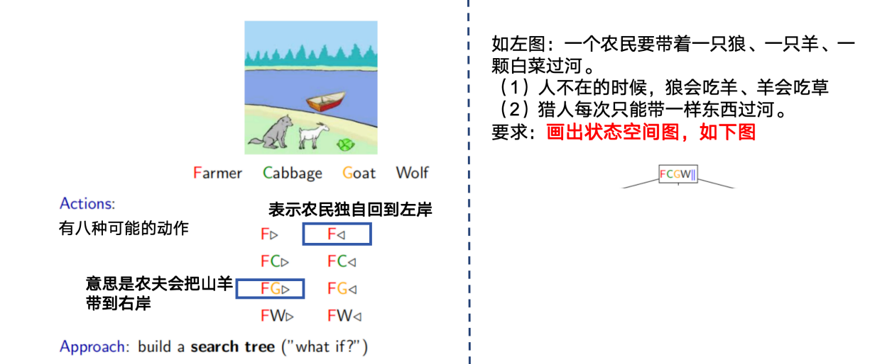
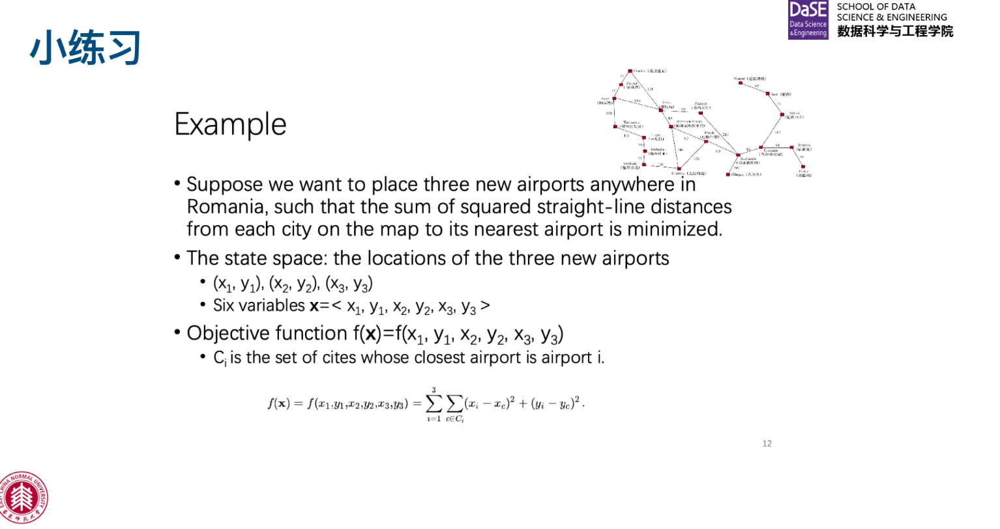

# **Project One**

# **搜索算法**


## 小练习




### 答案如图


## **1.** **算法回顾**

### • 1.1: BFS（每条边的权重为1）

```c++
#include<iostream>
#include<queue>
using namespace std;
vector<int> g[100001];
int visit[100001]={0};
int parent[100001]={0}; 
queue<int> q;

int bfs(int n){
    int startpoint=1,count=0;
    while(!q.empty()){
        startpoint=q.front();
        if(startpoint==n){
            count=0;
            while(startpoint!=1){
                startpoint=parent[startpoint];
                count++;
            }
            return count;
        }
        q.pop();
        visit[startpoint]=1;
        for(auto i:g[startpoint]){
            if(visit[i]==0){
                q.push(i);
                parent[i]=startpoint;
                visit[i]=1;
            }
        }
    }
    return -1;
}

int main(){
    int n=0,m=0,start=0,end=0;
    cin>>n>>m;
    for(int i=0;i<m;i++){
        cin>>start>>end;
        g[start].push_back(end);
    }
    for(int i=0;i<100000;i++){
        visit[i]=0;
        parent[i]=0;
    }
    q.push(1);
    cout<<bfs(n);
}
```

V是顶点数量，E是边数量

时间复杂度：O(E)

空间复杂度：O(V+E）

使用邻接表，会从起始点遍历可达点，遍历的最差情况是要遍历图中所有的边，因此时间复杂度是O(E)。题目需要记录邻接表(大小为E)、队列`q`(大小为V)、访问节点数组`visit`(大小为V)、父节点数组`parent`（大小为V）。


### • 1.2: 朴素版Dijkstra（图最短路）

```c++
#include <iostream>
#include <queue>
using namespace std;
vector<pair<int, int>> g[100001];
int state[100001] = {0};
int dis[100001] = {0};
#define _MAX 9999999

int dijkstra(int n)
{
    int startpoint = 1, t = 0;
    dis[1] = 0;
    for (int i = 0; i < n; i++)
    {
        t = -1;
        for (int j = 1; j <= n; j++)
        {
            if (state[j] == 0)
            {
                if (t == -1 || dis[j] < dis[t])
                {
                    t = j;
                }
            }
        }
        state[t] = 1;
        for (auto i : g[t])
        {
            int tmp1 = i.first;
            int tmp2 = i.second;
            if (state[tmp1] == 0)
            {
                dis[tmp1] = min(tmp2 + dis[t], dis[tmp1]);
            }
        }
    }
    if (dis[n] != _MAX)
        return dis[n];
    else
        return -1;
}

int main()
{
    int n = 0, m = 0, start = 0, end = 0, value = 0;
    cin >> n >> m;
    for (int i = 0; i < m; i++)
    {
        cin >> start >> end >> value;
        g[start].push_back({end, value});
    }
    for (int i = 0; i < 100000; i++)
    {
        state[i] = 0;
        dis[i] = _MAX;
    }
    cout << dijkstra(n);
}
```

V是顶点数量，E是边数量

时间复杂度：O(V+E)

空间复杂度：O(V+E)

### • 1.3: 堆优化版Dijkstra（图最短路）

```c++
#include <iostream>
#include <queue>
using namespace std;

vector<pair<int, int>> g[100001];
int state[100001] = {0};
int dis[100001] = {0};
#define _MAX 99999999
struct node
{
    friend bool operator<(node n1, node n2)
    {
        return n1.dis > n2.dis;
    }
    int dis;
    int number;
};

priority_queue<node> q;

int dijkstra(int n)
{
    dis[1] = 0;
    struct node cur_node;
    cur_node.dis = 0;
    cur_node.number = 1;
    q.push(cur_node);
    while (!q.empty())
    {
        cur_node = q.top();
        q.pop();
        int cur_number = cur_node.number;
        int cur_dis = cur_node.dis;
        if (state[cur_number])
        {
            continue;
        }
        state[cur_number] = 1;
        for (auto i : g[cur_number])
        {
            int tmp1 = i.first;
            int tmp2 = i.second;
            if (state[tmp1] == 0)
            {
                dis[tmp1] = min(tmp2 + dis[cur_number], dis[tmp1]);
                struct node new_node;
                new_node.dis = dis[tmp1];
                new_node.number = tmp1;
                q.push(new_node);
            }
        }
    }
    if (dis[n] != _MAX)
        return dis[n];
    else
        return -1;
}

int main()
{
    int n = 0, m = 0, start = 0, end = 0, value = 0;
    cin >> n >> m;
    for (int i = 0; i < m; i++)
    {
        cin >> start >> end >> value;
        g[start].push_back({end, value});
    }
    for (int i = 0; i < 10000; i++)
    {
        state[i] = 0;
        dis[i] = _MAX;
    }
    cout << dijkstra(n);
}
```

V是顶点数量，E是边数量

时间复杂度：O(VlogV)

空间复杂度：O(V+E)

## **2.** **⼋数码问题**

### • 2.1: DFS（解存在性问题）

```c++
#include <iostream>
#include <queue>
#include <vector>
#include <stack>
#include <set>
using namespace std;

struct node
{
    string cur_s;
    int cur_x = 0;
}; //状态，位置

int dx[4] = {0, -1, 0, 1};
int dy[4] = {-1, 0, 1, 0};
set<string> vis;
stack<node> st;
string target = "12345678x";

int dfs_8digits()
{
    while(!st.empty()) {
        struct node cur_node=st.top();
        st.pop();
        if (cur_node.cur_s == target) {
            return 1;
        }
        int x1 = cur_node.cur_x / 3;
        int y1 = cur_node.cur_x % 3;

        for (int i = 0; i < 4; i++) {
            int x2 = dx[i] + x1, y2 = dy[i] + y1; //移动后的x位置
            if (x2 < 0 || y2 < 0 || x2 > 2 || y2 > 2)
                continue;
            string new_s = cur_node.cur_s;
            int new_x = x2 * 3 + y2;
            swap(new_s[cur_node.cur_x], new_s[new_x]);
            struct node new_node;
            new_node.cur_s = new_s;
            new_node.cur_x = new_x;
            if (vis.count(new_s) == 0) {
                vis.insert(new_s);
                st.push(new_node);
            }
        }
    }
    return 0;
}

int main()
{
    string s = "";
    char t;
    int x = 0;
    for (int i=0;i<9;i++)
    {
        cin >> t;
        s += t;
        if (t == 'x')
        {
            x = i;
        }
    }
    vis.insert(s);
    struct node first_node;
    first_node.cur_s = s;
    first_node.cur_x = x;
    st.push(first_node);
    cout<<dfs_8digits();
}
```

​	使用`stack`用于dfs搜索过程中存储待搜索的节点，如果使用递归会导致调用层数过多报错。每次尝试将空格与周边存在的邻格交换，直到与目标状态一致。会使用`set`记录访问过的状态避免重复搜索。

### • 2.2: BFS（求解最少步数）

```c++
#include <iostream>
#include <queue>
#include <vector>
#include <set>
using namespace std;

struct node
{
    string cur_s;
    int cur_x = 0;
    int count = 0;
}; //状态，位置，层数

int dx[4] = {0, -1, 0, 1};
int dy[4] = {-1, 0, 1, 0};
queue<node> q;
set<string> vis;

string target = "12345678x";

int bfs_8digits()
{
    while (!q.empty())
    {
        struct node cur_node;
        cur_node = q.front();
        if (cur_node.cur_s == target)
        {
            return cur_node.count;
        }
        q.pop();
        int x1 = cur_node.cur_x / 3;
        int y1 = cur_node.cur_x % 3;

        for (int i = 0; i < 4; i++)
        {
            int x2 = dx[i] + x1, y2 = dy[i] + y1; //移动后的x位置
            if (x2 < 0 || y2 < 0 || x2 > 2 || y2 > 2)
                continue;
            string new_s = cur_node.cur_s;
            int new_x = x2 * 3 + y2;
            int new_count = cur_node.count + 1;
            swap(new_s[cur_node.cur_x], new_s[new_x]);
            if (vis.count(new_s))
            {
                continue;
            }
            else
            {
                vis.insert(new_s);
            }
            struct node new_node;
            new_node.cur_s = new_s;
            new_node.cur_x = new_x;
            new_node.count = new_count;
            q.push(new_node);
        }
    }
    return -1;
}

int main()
{
    string s = "";
    char t;
    int x = 0;
    for (int i=0;i<9;i++)
    {
        cin >> t;
        s += t;
        if (t == 'x')
        {
            x = i;
        }
    }
    vis.insert(s);
    struct node first_node;
    first_node.cur_s = s;
    first_node.cur_x = x;
    q.push(first_node);
    cout<<bfs_8digits();
}
```

​	使用`queue`用于bfs搜索过程中存储待搜索的状态，通过逐层扩展来找到从初始状态到目标状态的最少步数。每次尝试将空格与周边存在的邻格交换，直到与目标状态一致。会使用`set`记录访问过的状态避免重复搜索。相比于dfs，bfs通常能够更快地找到解，且能够找到最短路径。

### • 2.3: Dijkstra（特殊的A star）

```c++
#include <iostream>
#include <queue>
#include <vector>
#include <set>
using namespace std;

struct node
{
    string cur_s;
    int cur_x = 0;
    int count = 0;
    friend bool operator< (node n1, node n2)
    {
        return n1.count > n2.count;
    }
}; //状态，位置，层数

int dx[4] = {0, -1, 0, 1};
int dy[4] = {-1, 0, 1, 0};
priority_queue<node> q;
set<string> vis;

string target = "12345678x";

int dijkstra_8digits()
{
    while (!q.empty())
    {
        struct node cur_node;
        cur_node = q.top();
        if (cur_node.cur_s == target)
        {
            return cur_node.count;
        }
        q.pop();
        int x1 = cur_node.cur_x / 3;
        int y1 = cur_node.cur_x % 3;

        for (int i = 0; i < 4; i++)
        {
            int x2 = dx[i] + x1, y2 = dy[i] + y1; //移动后的x位置
            if (x2 < 0 || y2 < 0 || x2 > 2 || y2 > 2)
                continue;
            string new_s = cur_node.cur_s;
            int new_x = x2 * 3 + y2;
            int new_count = cur_node.count + 1;
            swap(new_s[cur_node.cur_x], new_s[new_x]);
            if (vis.count(new_s))
            {
                continue;
            }
            else
            {
                vis.insert(new_s);
            }
            struct node new_node;
            new_node.cur_s = new_s;
            new_node.cur_x = new_x;
            new_node.count = new_count;
            q.push(new_node);
        }
    }
    return -1;
}

int main()
{
    string s = "";
    char t;
    int x = 0;
    for (int i=0;i<9;i++)
    {
        cin >> t;
        s += t;
        if (t == 'x')
        {
            x = i;
        }
    }
    vis.insert(s);
    struct node first_node;
    first_node.cur_s = s;
    first_node.cur_x = x;
    q.push(first_node);
    cout << dijkstra_8digits();
}
```

​	使用`priority_queue`用于dijkstra搜索过程中存储待搜索的状态，保证每次从队列中取出的节点是当前最小步数的节点，虽然在这里和bfs效果相同，因为每一步代价都是一样的。每次尝试将空格与周边存在的邻格交换，直到与目标状态一致。会使用`set`记录访问过的状态避免重复搜索。由于交换步骤的代价肯定是1，所以效果与bfs一致。


### • 2.4: A star（求解最少步数）

```c++
#include <iostream>
#include <queue>
#include <set>
#include <map>
using namespace std;

struct node
{
    string cur_s;
    int cur_x = 0;
    int count = 0;
    int fn = 0;
    string path;
    friend bool operator<(node n1, node n2)
    {
        return n1.fn > n2.fn;
    }
}; //状态，位置，层数
int dx[4] = {0, -1, 0, 1};
int dy[4] = {-1, 0, 1, 0};
char step[4] = {'l', 'u', 'r', 'd'};
priority_queue<node> q;
map<string,int> vis;

string target = "12345678x";

bool answer_available(string s)
{
    int cnt = 0;

    for (int i = 0; i < 9; i++)
    {
        for (int j = i + 1; j < 9; j++)
        {
            if (s[i] == 'x' || s[j] == 'x')
            {
                continue;
            }
            if (s[i] > s[j])
            {
                cnt++;
            }
        }
    }
    return cnt % 2;
}

int f(struct node cur_node)
{
    int h = 0;
    int x1 = cur_node.cur_x / 3;
    int y1 = cur_node.cur_x % 3;
    for (int i = 0; i < 9; i++)
    {
        if (i == cur_node.cur_x)
        {
           continue;
        }
        else
        {
            h += abs(i / 3 - (cur_node.cur_s[i] - '1') / 3) + abs(i % 3 - (cur_node.cur_s[i] - '1') % 3);
        }
    }
    return h + cur_node.count;
};

string A_8digits()
{
    while (!q.empty())
    {
        struct node cur_node;
        cur_node = q.top();
        if (cur_node.cur_s == target)
        {
            return cur_node.path;
        }
        q.pop();
        if(vis[cur_node.cur_s]<cur_node.count){continue;}
        int x1 = cur_node.cur_x / 3;
        int y1 = cur_node.cur_x % 3;

        for (int i = 0; i < 4; i++)
        {
            int x2 = dx[i] + x1, y2 = dy[i] + y1; //移动后的x位置
            if (x2 < 0 || y2 < 0 || x2 > 2 || y2 > 2)
                continue;
            string new_s = cur_node.cur_s;
            int new_x = x2 * 3 + y2;
            int new_count = cur_node.count + 1;
            string new_path = cur_node.path + step[i];
            swap(new_s[cur_node.cur_x], new_s[new_x]);
            if (vis.count(new_s)&&vis[new_s]<=new_count)
            {
                continue;
            }
            else
            {
                vis[new_s]=new_count;
            }
            struct node new_node;
            new_node.cur_s = new_s;
            new_node.cur_x = new_x;
            new_node.count = new_count;
            new_node.fn = f(new_node);
            new_node.path = new_path;
            q.push(new_node);
        }
    }
    return "unsolvable";
}

int main()
{
    string s = "";
    char t;
    int x = 0;
    for (int i = 0; i < 9; i++)
    {
        cin >> t;
        s += t;
        if (t == 'x')
        {
            x = i;
        }
    }
    vis[s]=0;
    struct node first_node;
    first_node.cur_s = s;
    first_node.cur_x = x;
    f(first_node);
    q.push(first_node);
    if (answer_available(s))
    {
        cout << "unsolvable";
    }
    else
    {
        cout << A_8digits();
    }
}

```

​	同样使用`priority_queue`保证了每个处理的节点都是当前步数和估计剩余步数之和最小的节点。每次尝试将空格与周边存在的邻格交换，直到与目标状态一致。会使用`map`记录访问过的节点以及对应的`fn`，如果访问过的节点的`fn`更新后会比`map`记录中的小，那么就会修改`map`并将节点修改为新状态加入`priority_queue`。函数`f`是评价函数$f(n)=g(n)+h(n)$，$h(n)$的计算方法在这里是计算1~8到正确位置的曼哈顿距离。A*算法的主要精髓在评价函数$f(n)=g(n)+h(n)$。*相比于Dijkstra算法，A*算法在启发式函数的指导下能够更加高效地找到最短路径。当$h(n)=0$ 时算法变为Dijkstra；当$h(n)=0$ 并且边权为1时变为 bfs。

## 小练习



### 答案如图

